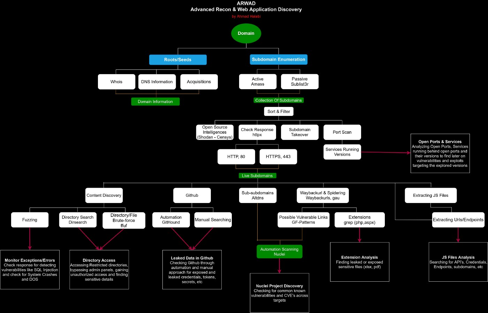

# Table of Contents <!-- omit from toc -->

- [Advanced Reconnaissance Methodology](#advanced-reconnaissance-methodology)
- [Best Kali mirror server](#best-kali-mirror-server)
- [Lists](#lists)
  - [Wordlists](#wordlists)
  - [Resolvers](#resolvers)
- [ProjectDiscovery Suite](#projectdiscovery-suite)
  - [HTTPX](#httpx)
  - [Subfinder](#subfinder)
  - [Katana](#katana)
  - [Nuclei](#nuclei)
- [Information Gathering](#information-gathering)
  - [DNS](#dns)
  - [Certificates](#certificates)
    - [Direct](#direct)
    - [Indirect](#indirect)
- [Crawling](#crawling)
  - [Wayback Machine](#wayback-machine)
    - [Gau](#gau)
  - [Spidering](#spidering)
    - [Owasp ZAP](#owasp-zap)
    - [Katana](#katana-1)
    - [](#)


# Advanced Reconnaissance Methodology

<p align="center">
  
</p>

&nbsp;
# Best Kali mirror server

```bash
curl -fsSL https://raw.githubusercontent.com/IceM4nn/mirrorscript-v2/master/mirrorscript-v2.py | python -
```

&nbsp;
# Lists

## Wordlists

- [SecLists](https://github.com/danielmiessler/SecLists)
- [Trickest](https://github.com/trickest/wordlists)
- [Assetnote](https://wordlists.assetnote.io/)

## Resolvers

- [Trickest](https://github.com/trickest/resolvers)

&nbsp;
# ProjectDiscovery Suite

**Installation**

```bash
go install -v github.com/projectdiscovery/pdtm/cmd/pdtm@latest
pdtm -up && pdtm -ia && pdtm -ua
```

## HTTPX

```bash
echo {domain} | httpx -fr -r {resolvers} -p 80,443,8080,8443 -timeout 20 -td -irr -include-chain -json -silent
```

## Subfinder

```bash
subfinder -d {domain} -rL {resolvers} -all -pc {provider_config} -nc -silent
```

## Katana

```bash
cat {httpx_output} | katana -r {resolvers} -d 5 -jc -jsl -kf all -fx -hl -nos -xhr -nc -silent
```

## Nuclei

```bash
nuclei -u {domain} -t {templates} -r {resolvers} -fr -irr -timeout 20 -j -silent -nc
```

&nbsp;
# Information Gathering

## DNS

```bash
dig {domain} @8.8.8.8
```

## Certificates

### Direct

```bash
openssl s_client -connect {domain}:443
```

### Indirect

```bash
curl -s https://crt.sh/?q={domain}&output=json | jq
```

&nbsp;
# Crawling

## Wayback Machine

### [Gau](https://github.com/lc/gau)

```bash
echo {domain} | gau
```

## Spidering

### [Owasp ZAP](https://www.zaproxy.org/)

### [Katana](#katana)

### 


